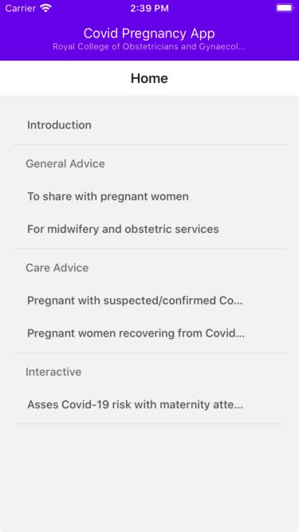
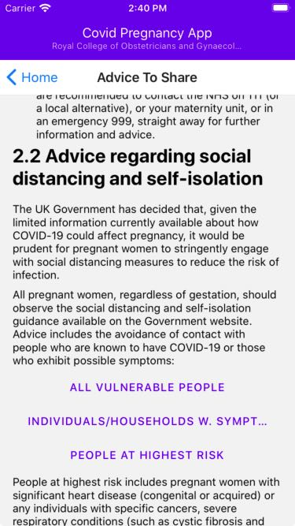
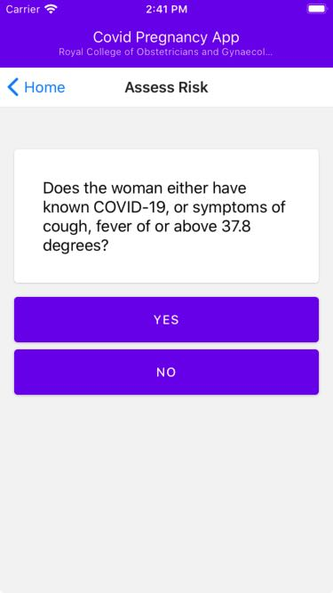

# Covid Pregnancy App

Advice for pregnancy-related medical practitioners (e.g. obstetricians & gynaecologists) provided by the [Royal College
of Obstetricians & Gynaecologists](https://www.rcog.org.uk/).

## Screenshots

## How to Contribute

Please [submit an issue](https://github.com/rcog-innovation/covid-app/issues) if you would like to volunteer on this
project. You are also welcome to submit pull requests directly.

All code is released under an MIT license.

## Key Links

- [RCOG Coronavirus Infection in Pregnancy
  Docs](https://www.rcog.org.uk/globalassets/documents/guidelines/2020-05-13-coronavirus-covid-19-infection-in-pregnancy.pdf)
- [RCOG website](https://www.rcog.org.uk/)
- [Code 4 Covid](https://www.code4covid.org/)
- [Demo build](https://appetize.io/app/bwj9pcympqr0cd7fy4rdca6qqg?device=iphone6s&scale=75&orientation=portrait&osVersion=13.3) - may not be the latest version
